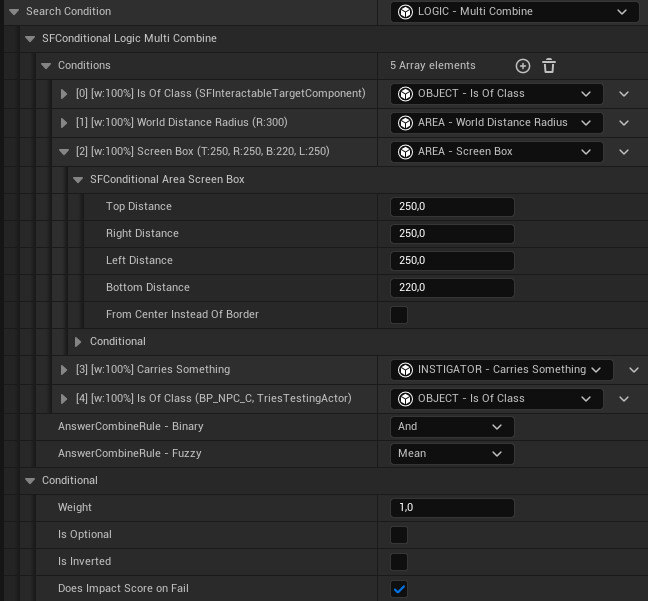
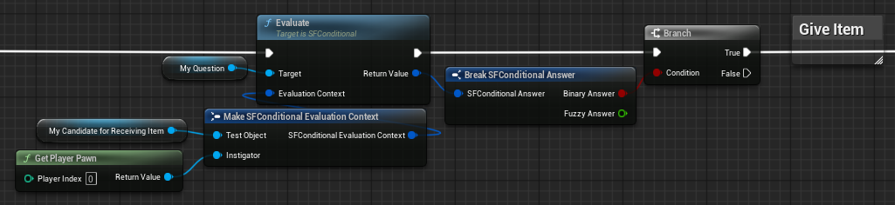
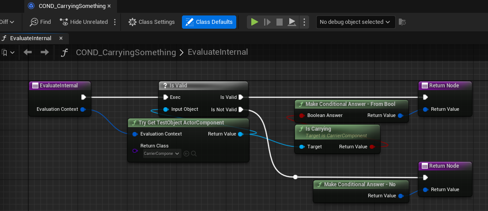
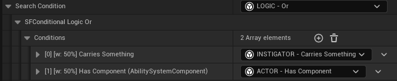

# Unreal Conditional

## Concept

Adds a `USFConditional` base class, which allows designers to easily configure complex
questions about objects. Answers to Conditional questions return both a binary and fuzzy answer and are thus
open for threshold-based or weighted answer handling.

Conditionals are open for extension: this plugin provides a few project-agnostic conditionals,
but the intention is for you to build your own subclasses for your systems, as needed.

> This is basically an implementation of the "P2Conditional" system Double Fine implemented and presented in this blog post:
<a href="https://www.doublefine.com/news/devin-target-search">Behind The Code: Locked On Target</a>.

> This plugin includes some code for scoped automation test worlds from the excellent 
<a href="https://github.com/barzb/UnrealWeekendUtils">Unreal Weekend Utils</a>.

## Table Of Contents

* [Supported Engine Version](#supported-engine-version)
* [Installation](#installation)
* [Development Status](#development-status)
* [Usage](#usage)
    * [Author Conditional Question](#author-conditional-question)
    * [Evaluate Question For Object](#evaluate-question-for-object)
    * [Add New Conditional Type](#add-new-conditional-type)
    * [Add New Conditional Type With Children](#add-new-conditional-type-with-children)
    * [Gameplay Debugger Integration](#gameplay-debugger-integration)

## Supported Engine Version

The plugin was developed for Unreal Engine 5.5+, though it should work for all 5.X versions.

## Installation

The best way is to clone this repository as a submodule; that way you can contribute
pull requests if you want and more importantly, easily get latest updates.
The project should be placed in your project's `Plugins` folder.

```
> cd YourProject
> git submodule add https://github.com/Strayfarer/SFConditional
> git add ../.gitmodules
> git commit
```

Alternatively you can download the ZIP of this repo and place it in
`YourProject/Plugins/`.

## Development Status

This plugin is currently in an beta state. As of publishing, there are no known bugs. Included are 
quality of life features such as Blueprint, Gameplay Debugger and data validation support.
It hasn't been battle-tested by me in a full-on production yet, but it got iterated already
during a few of my private projects and is unit-tested.

Feel free to open new issues in the GitHub issues tab.
Any general feedback and pull-requests are much appreciated!

## Usage

### Author Conditional Question

To configure a Conditional question, add a new `SFConditional` property via BP or C++,
expose it to be editable in the editor and compile.

[<p align="center"></p>](./Docs/BlueprintDefinition.png)

Now click on the property and in the details tab, build your question, by assigning the
conditional tree modelling the question you have.

in this example, we building a question asking whether the instigator can give an item to someone:

[<p align="center"></p>](./Docs/BlueprintDefinition.png)

We're requiring the object to be an interactable target component, in reasonable range and screen area,
component of an NPC. And we're requiring the instigator to carry something.

### Evaluate Question For Object

After having done the setup above, you can add the component to an actor of your choice,
and pick another component on the same actor:

[<p align="center"></p>](./Docs/Picking.png)

In C++, you can additionally pass in a `FSFConditionalDebugTrace`, to which the conditional evaluation
will write debug information per conditional, with an option to retrieve an easily readable debug string
at the end.

```C++
FSFConditionalDebugTrace DebugTrace;

FSFConditionalAnswer Answer = SearchCondition->Evaluate({ 
    MyCandidateForReceivingItem, // = TestObject
    PlayerPawn,                  // = Instigator
    &DebugTrace                  // optional debug infos
  });

UE_LOG(LogMyGame, VeryVerbose, TEXT("%s"), *DebugTrace->ToString())

if (Answer.bBinaryAnswer)
{
    // Give Item
}
```

### Add New Conditional Type

New Conditionals can easily be implemented by deriving a C++ or BP class from `USFConditional`.
In both languages, you need to override the `EvaluateConditional` method:

[<p align="center"></p>](./Docs/BlueprintRetrieve.png)

In both languages, you furthermore have the option to override `CreateConfigurationDebugString`,
in which you can describe the current configuration of your conditional to debug systems such as
the `FSFConditionalDebugTrace`.

### Conditional Runtime Errors

Conditional evaluations may have additional requirements on the tested object and instigator passed in.
To express such runtime errors, conditionals may return a `FSFConditionalAnswer` with an error message.

The `SFConditional` plugin comes with a few predefined error answers. In C++, those can be found in
the `SF::Conditional::Answer::Error` namespace. For BP the function library exposes the same set
of errors in the `SF|Conditional|Answer|Error` category.

### Add New Conditional Type With Children

In C++ you additionally have the option to add data validation and child conditionals.
`IsDataValid` will be called automatically on all children in a conditional tree, if it's 
called on the root and all parent conditionals in the tree implement `GetImmediateChildren`.

It's also wise to add `TitleProperty=ConditionalTitlePropertyString` as meta attribute for 
child conditional properties, to get a nice title string per container entry.
Contents of `ConditionalTitlePropertyString` will be automagically computed for you!

```C++
/**
 * Answers Yes if *any* sub-conditional gives true as binary answer, otherwise No.
 * 
 * Note that the fuzzy answers of the sub-conditionals aren't considered in any way.
 */
UCLASS(DisplayName="LOGIC - Or")
class SFCONDITIONAL_API USFConditional_Logic_Or : public USFConditional
{
	GENERATED_BODY()

protected:
	// - USFConditional
	virtual FSFConditionalAnswer EvaluateInternal_Implementation(const FSFConditionalEvaluationContext& EvaluationContext) override;
	virtual FInt32Range GetAllowedChildrenNumRange_Implementation() const override;
	virtual TArray<USFConditional*> GetImmediateChildren_Implementation() const override;
	virtual FString CreateConfigurationDebugString_Implementation() const override;
	// --

	/** The conditionals to combine by OR. */
	UPROPERTY(EditDefaultsOnly, Instanced, meta=(TitleProperty=ConditionalTitlePropertyString))
	TArray<TObjectPtr<USFConditional>> Conditions = {};
};
```
Because `USF_Conditional_Logic_Or` assigns `TitleProperty=ConditionalTitlePropertyString` as meta attribute
to its `Conditions` property, each child array entry in the editor gets a nice title.

[<p align="center"></p>](./Docs/BlueprintRetrieve.png)

### Gameplay Debugger Integration

Conditionals do have an override to draw debug visualization for themselves (see
`USFConditional_Area_ScreenBox::VisualizeWithGameplayDebugger` for an example), but the plugin itself **doesn't come
with a debugger category**, instead you have to build one for your own systems where you use conditionals.

The reason is that Conditionals don't have a global registry or anything a gameplay debugger could draw data from:
Conditionals are meant to be used as a tool being a part in systems built on top. If those systems on top are able to
expose their conditionals to the debugger, then the override can be easily used to visualize them.

For an example see the target search system implemented by Double Fine and also presented in the aforementioned blog post
<a href="https://www.doublefine.com/news/devin-target-search">Behind The Code: Locked On Target</a>.
